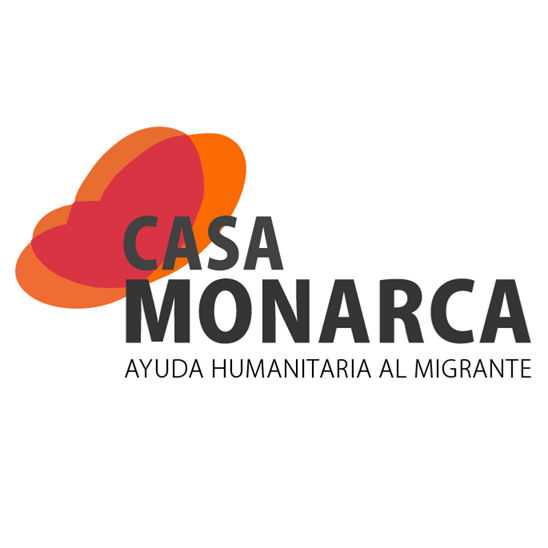
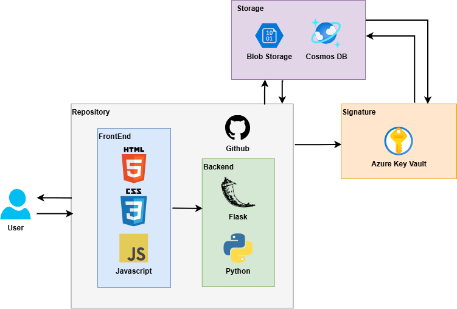

# Migra Seguro

## Descripción general

Migra Seguro es una plataforma web desarrollada para la gestión y firma digital de documentos en la Casa Monarca, una casa de migrantes ubicada en García, Nuevo León. La solución permite a los usuarios registrar, subir, firmar y verificar documentos de manera segura, utilizando tecnologías de Microsoft Azure como Key Vault para la firma criptográfica y Cosmos DB para el almacenamiento de registros. El sistema implementa control de acceso por niveles, asegurando que solo usuarios autorizados puedan realizar acciones críticas, y almacena los archivos en Azure Blob Storage o localmente según la configuración.

La plataforma facilita la administración eficiente de documentos y usuarios, garantizando la integridad y autenticidad de la información, y contribuye a la digitalización de procesos en organizaciones sociales que requieren altos estándares de seguridad y trazabilidad documental.

## Características clave

* **Gestión de documentos**: Registro, carga, firma y verificación de documentos digitales.
* **Firma digital segura**: Uso de Azure Key Vault para la firma criptográfica de documentos.
* **Almacenamiento seguro**: Documentos y registros almacenados en Azure Blob Storage y Cosmos DB.
* **Control de acceso**: Niveles de usuario y permisos para proteger acciones críticas.
* **Verificación de integridad**: Validación de la autenticidad y no alteración de los documentos firmados.
* **Interfaz moderna**: Aplicación web intuitiva y fácil de usar.
* **Escalabilidad y flexibilidad**: Soporte para almacenamiento local o en la nube según la configuración.

## Solución a las problemáticas

| **Problemática**                                                | **Solución**                                                |
| --------------------------------------------------------------- | ----------------------------------------------------------- |
| Riesgo de manipulación o pérdida de documentos físicos          | Digitalización y almacenamiento seguro en la nube           |
| Falta de trazabilidad y control de acceso                       | Registro de acciones y permisos por usuario                 |
| Dificultad para verificar la autenticidad de documentos         | Firma digital y validación criptográfica                    |
| Procesos manuales y lentos                                      | Automatización de flujos de registro y firma                |

## Arquitectura / Tech Stack

Migra Seguro combina herramientas modernas de desarrollo web y servicios de Azure:

* **Frontend**: HTML, CSS y JavaScript
* **Backend**: Flask + Python
* **Servicios en la nube**: Azure Key Vault, Azure Blob Storage, Azure Cosmos DB

## Componentes principales

### Gestión de documentos

Permite a los usuarios cargar, firmar y verificar documentos de manera sencilla y segura.

### Firma digital

Utiliza Azure Key Vault para firmar documentos digitalmente, garantizando su integridad y autenticidad.

### Control de acceso

Sistema de roles y permisos para asegurar que solo usuarios autorizados puedan realizar acciones críticas.

### Almacenamiento seguro

Documentos y registros almacenados en Azure Blob Storage y Cosmos DB, con opción de almacenamiento local.

## Principios de IA Responsable

Como equipo consideramos fundamental implementar soluciones alineadas con los principios éticos de la Inteligencia Artificial para procurar un beneficio general.

| **Principio**        | **Aplicación en Migra Seguro**                                                                                                    |
| -------------------- | --------------------------------------------------------------------------------------------------------------------------------- |
| Equidad              | El acceso y las acciones están reguladas por roles claros y auditables.                                                          |
| Inclusión            | Interfaz accesible para usuarios con distintos niveles de experiencia tecnológica.                                                |
| Fiabilidad           | Uso de servicios de Azure para garantizar la seguridad y disponibilidad de la información.                                       |
| Transparencia        | Registro de acciones y trazabilidad de los documentos.                                                                           |
| Privacidad           | No se almacena información sensible innecesaria y se protege el acceso a los documentos.                                         |
| Rendición de cuentas | Todas las acciones quedan registradas y pueden ser auditadas por responsables autorizados.                                       |

## Futuros pasos

* **Integración de notificaciones**: Alertas automáticas para firmas pendientes o documentos nuevos.
* **Soporte móvil**: Acceso y firma desde dispositivos móviles.
* **Reportes avanzados**: Métricas de uso y auditoría de documentos.
* **Integración con otros sistemas**: Conexión con plataformas de gestión de organizaciones sociales.
* **Mejoras de accesibilidad**: Funcionalidades para usuarios con capacidades diferentes.

## Equipo:
Ricardo Marín Pérez | A01174384

Daniel Ríos Zúñiga | A01174445

José Antonio Torres Villegas | A00835737

Mario Alberto Landa Flores | A00836172

Victor Adid Salgado Santana | A01710023

## Licencia

Este proyecto está licenciado bajo la licencia MIT. Consulta el archivo LICENSE para más detalles.

